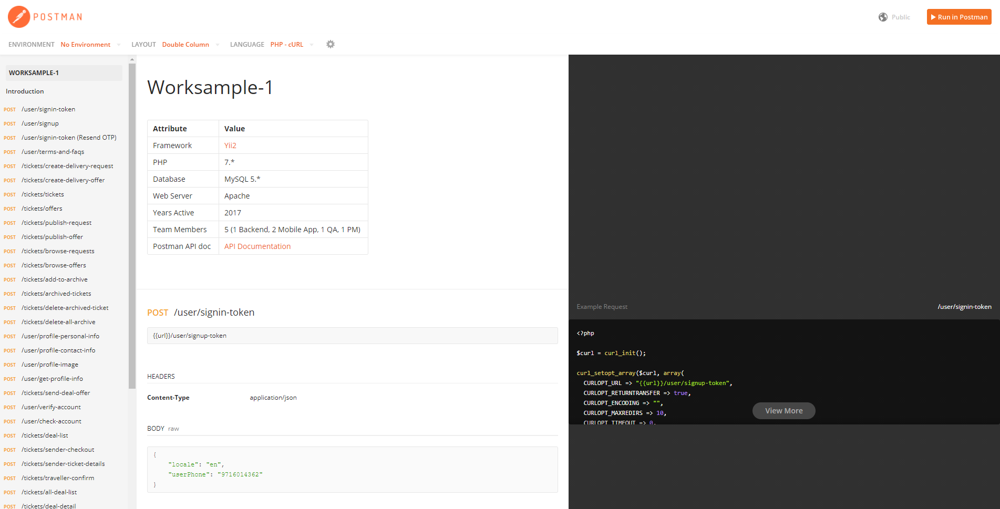

# Worksample-1

This was a project by which a user can deliver any goods from America to Mexico or vice versa. User has to signup and raise a ticket to send their goods from 1 location to another, and set a priority of delivery as per the prices available. Any truck driver will pick up goods from the warehouse and will deliver and update the status on the mobile app using an embedded tablet inside the truck. 

| Attribute | Value |
| ------ | ------ |
| Framework | [Yii2](https://www.yiiframework.com/doc/guide/2.0/en/intro-yii) |
| PHP | 7.* |
| Database | MySQL 5.* |
| Web Server | Apache |
| Years Active | 2017 |
| Team Members | 5 (1 Backend, 2 Mobile App, 1 QA, 1 PM) |
| Postman API doc | [API Documentation](https://documenter.getpostman.com/view/729247/TVRefBef) |


DIRECTORY STRUCTURE
-------------------

```
common
    components/          contains shared ACL and APIHelper and API Input Validation class
    widgets/             contains Alert widget for UI
    models/              contains model classes used in both backend and frontend
backend (Admin Panel)
    assets/              contains application assets such as JavaScript and CSS
    controllers/         contains Web controller classes
    models/              contains backend-specific model classes
    views/               contains view files for the Admin UI
    web/                 contains the entry script and Web resources (AdminLTE assets)
frontend (Frontend Website)
    controllers/         contains Web controller classes
    models/              contains frontend-specific model classes
    views/               contains view files for the Web application
    web/                 contains the entry script and Web resources
frontend/modules/api (API Module)
    controllers/         contains API controller classes
    models/              contains API specific model classes
```

SCREENSHOT
-------------------

     
**Note: Only required files are provided to review code and structure for security purpose, API doc is also anonymized for keys and their values **